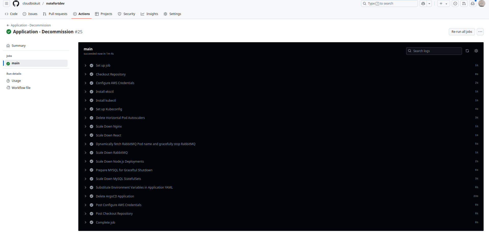

# NOTEFORT: A Showcase of Cloud & DevOps Best Principles

## About 
No matter the size or complexity of your application, it should follow the design and deployment principles of **NOTEFORT** ensuring scalability, resilience, and efficiency in the cloud.

My primary goal is to demonstrate my expertise in modern cloud architecture design and industry-standard deployment strategies.  

## Bridging the Gap
As a cloud engineer, building applications may seem outside the scope of infrastructure and systems management. However, a hands-on understanding of the application development process enables more effective collaboration with developers. You'll speak the language of developers, understand their challenges, and propose cloud solutions that integrate with the application's needs. 

Building NOTEFORT reinforced my understanding of infrastructure from a developer’s perspective. It can do the same for you.

## Application Design
NOTEFORT ensures availability of your notes through a decoupled backend microservices architecture even if individual services experience downtime.  

The application uses a React-based user interface for input, which is processed by two Node.js backend services that communicate via RabbitMQ.

<br>

<div align="center">
  
</div>  

### Key Concepts
- All frontend and API requests are routed and proxied through Nginx proxy server.
- The React service triggers API calls.
- RabbitMQ handles the messaging queue for backend microservices.
- Only Backend services process input and store it in their corresponding databases.

## Application Logic
#### Service `REACT`
1. On load, the react service calls the GET APIs of both nodejsa and nodejsb to display:
   - Entries from the table main in mysqla.
   - Entries from the table main in mysqlb.

2. The react service provides a text input box and an "insert" button. When the "Insert" button is clicked:
   - It calls the POST API of nodejsa to insert a new record into mysqla.
   - It refreshes the UI by calling the GET APIs of both nodejsa and nodejsb to display the updated data.

#### Service `NODEJSA`
1. Inserts a new record into the main table of mysqla.
2. Produces a message to the rabbitmq queue containing two values:
   - The ID of the newly inserted record.
   - The message content from the newly inserted record.

#### Service `NODEJSB`
1. Listens for messages from the rabbitmq queue produced by nodejsa.
2. Upon receiving a message, it inserts a new record into the main table of mysqlb, where:
   - The ID from the message is stored as ida.
   - The message content from the message is stored as msgcp.

## Cloud Architecture
Click on [this link](./images/architecture.jpeg) to to see the high-resolution version.

<p align="center">
  <a href="./images/architecture.jpeg">
    
  </a>
</p>

## Docker
Containers encapsulate application code and dependencies, ensuring consistency across development, testing, and production environments. They offer portability, scalability, and resource efficiency, making it easier to deploy and manage microservices-based architectures like NOTEFORT in both local and cloud environments.

NOTEFORT is fully containerized with Docker:

- Frontend: `react` container Built with React.js, providing a simple interface for data input and visualization.
- Backend: Two Node.js containers `nodejsa` and `nodejsb` with RESTful APIs.
- Message Broker: `rabbitmq` container facilitates communication between the microservices.
- Database: Each backend service has its own MySQL database container instance `mysqla` and `mysqlb`.
- Reverse Proxy: `nginx` container Acts as a reverse proxy for the frontend.

## Terraform (IaC)
Infrastructure as Code (IaC) streamlines cloud infrastructure management by automating resource provisioning and configuration through code. It ensures consistency, reduces human error, and simplifies version control, making infrastructure changes auditable and repeatable. IaC enables faster deployment, scaling, and recovery while supporting collaborative development practices. 

NOTEFORT AWS Infrastructure and EKS cluster are provisioned using Terraform.

## HashiCorp Cloud Vault Secrets
HashiCorp Vault is a powerful tool for securely storing and accessing sensitive data such as API keys, database credentials, and other secrets. It provides centralized secret management, access control, and encryption, ensuring that applications can securely retrieve secrets without hardcoding them.

NOTEFORT utilizes HashiCorp Vault to securely manage and inject secrets into its Kubernetes environment.

## Kubernetes
Kubernetes deployment offers scalable, automated, and resilient container orchestration for modern applications. It efficiently manages containerized workloads, automates resource allocation, and ensures high availability through self-healing mechanisms. 

With features like rolling updates, service discovery, and load balancing, Kubernetes simplifies application deployment and scaling. Additionally, its portability and integration with cloud-native environments make it ideal for managing complex, distributed applications across various cloud  environments.

NOTEFORT application is deployed in a Kubernetes cluster.

## Cluster Autoscaler
The Cluster Autoscaler scales the number of nodes in the Kubernetes cluster. If there are not enough resources on existing nodes to schedule new pods, the Cluster Autoscaler can add new nodes to the cluster. Conversely, if nodes are underutilized and pods can be moved to other nodes, the Cluster Autoscaler will remove idle nodes to save costs. 

NOTEFORT uses the Kubernetes Cluster Autoscaler.

## VPA & HPA
Vertical Pod Autoscaler (VPA) and Horizontal Pod Autoscaler (HPA) work together to optimize pod resource allocation and scaling. HPA adjusts the number of pod replicas based on CPU or memory utilization, ensuring optimal load distribution and availability. VPA, on the other hand, dynamically adjusts the resource requests and limits of individual pods based on usage, improving resource efficiency. 

NOTEFORT leverages both HPA and VPA.

## Helm
Helm is a package manager for Kubernetes that simplifies the deployment and management of applications by using Helm charts. It helps with versioning, rollbacks, and dependency management, making it easier to maintain and update applications in a Kubernetes cluster.

NOTEFORT uses Helm Charts.

## Prometheus & Grafana
Prometheus is an open-source monitoring and alerting toolkit designed for reliability and scalability. It collects and stores metrics in a time-series database, allowing for real-time monitoring of applications and infrastructure. Grafana is an open-source visualization and analytics platform that integrates with Prometheus to display the collected metrics in customizable, interactive dashboards. 

NOTEFORT uses Prometheus for custom metrics and Grafana.

## Getting Started
This repository contains the application code, and the workflow to create ECR registries, build, and push images. Also, it contains Terraform files and Kubernetes manifests, and the workflows to provision AWS infrastructure, set up the EKS cluster, and deploy the application.

### Prerequisites: AWS OIDC Provider  
You have to Setup AWS OIDC Provider and create an IAM role to be used by GitHub Actions to authenticate with AWS, refer to the [AWS OIDC Provider guide](https://aws.amazon.com/blogs/security/use-iam-roles-to-connect-github-actions-to-actions-in-aws) for detailed instructions. You can grant the IAM role used by GitHub Actions the AdministratorAccess IAM Policy, in a production environment adhere to the principle of least privilege.

### Prerequisites: SSH Key Pair 
On your system generate and push to AWS the SSH pubic key required to SSH into EKS cluster public EC2 instances using the `ssh.sh` script:
   ```bash
   cd ./scripts
   chmod +x ssh.sh
   ./ssh.sh 
   ```

### Prerequisites: HashiCorp Cloud Vault Secrets
In HashiCorp Vault Cloud Secrets, Create a secret `MYSQL_PASSWORD`containing the MySQL database password. 

This secret is securely stored in HCP and later fetched during deployment using Kubernetes Secret to inject the database password into Kubernetes MySQL StatefulSets `mysqla` and `mysqlb` and Kubernetes Node.js Deployments `nodejsa` and `nodejsb`. 

### Prerequisites: Forking the Repositoy
Go to **notefort** repository page on GitHub and Click the "Fork" button at the top right of the page.

### Prerequisites: GitHub Actions Secrets
Forking does not copy Github Actions Secrets. Create the following Github Actions Secrets in the newly forked repository:

- **AWS_ACCOUNT_ID**: The 12-digit AWS account number where the resources will be deployed.
- **AWS_REGION**: The AWS region (e.g., us-east-1) where the infrastructure will be provisioned.
- **GH_IAM_ROLE**: The name of the IAM role you created in the Prerequisites step.
- **AWS_USER**: The IAM user to be given administrative priviliges on the EKS cluster, this user will be able to view and manage the new EKS cluster in the AWS Console and from AWS CLI. 
- **HCP_CLIENT_ID**: The HCP service principal client ID.
- **HCP_CLIENT_SECRET**: The HCP service principal client secret.
- **HCP_API_ENDPOINT**: The HCP API Endpoint URL for HashiCorp Cloud Platform (HCP) Vault Secrets.

Ensure these Secrets are created before running the Github Actions Workflow.

## GitHub Workflows
**NOTE**: To improve clarity, I followed the approach of creating multiple GitHub Workflows, ensure you execute them sequentially. 

**NOTE**: For advanced engineers, the workflows can be combined if preferred, a Workflow can be refractored as a seaparate Job.

### Build Artifacts & Create ECR Registries
To create ECR registries, build and tag (commit hash) and push the images, run the workflow `Artifacts - Build`.

**Note**: For simplicity, this workflow builds (same tag) all images in a single process. In a typical development setup, each image should be built (different tags) separately with its own workflow.

### Prepare Backend for Terraform 
To provision the terraform S3 bucket and the DynamoDB Table, run the GitHub Actions workflow `Backend - Create`.

### Provision AWS Infrastructure and EKS Cluster 
To intialize Terraform state in the newly created bucket, and provision the AWS infrastructure and the EKS cluster resources, run the GitHub Actions workflow `Infrastructure - Provision`.

**Note**: For advanced engineers, refactor the Terraform files into `modules` to make the code ready for multiple environments (e.g., development and production). Additionaly, modify terraform `init` and `apply` commands to account for `.tfvars` files.

### Map IAM User to Kubernetes RBAC
To map the IAM user to Kubernetes RBAC, run the GitHub Actions workflow `EKS - Map`.

**Note**: the IAM user defined in the GitHub Actions Variable `AWS_USER` will be mapped to the system:masters EKS RBAC group, granting them administrative privileges on the newly created cluster. As a result, `AWS_USER` will be able to view and manage the new EKS cluster in the AWS Console and from AWS CLI. 

### Install Autoscaler, VPA, and Metrics Server
To install the Cluster Autoscaler, the Vertical Pod Autoscaler (VPA), and the Metrics Server in the EKS `kube-system` namespace, run the GitHub Actions workflow `Autoscaler - Install`.

**Note**: The necessary IAM permissions for the Cluster Autoscaler to modify EKS node groups have already been accounted for by attaching a managed IAM policy to the IAM role associated with the node groups.

### Setup Prometheus and Grafana
To install Prometheus and its Adapter, and Grafana in the EKS `monitoring` namespace, run the GitHub Actions workflow `Monitoring - Setup`.

**Note**: Follow the instructions provided in the workflow output to get Grafana password, and to port-forward a tunnel to Grafana. To access Grafana UI on your system, go to: https://localhost:3000  
**Note**: Run the following command to port-forward to Prometheus: kubectl port-forward -n monitoring svc/prometheus-operated `port`:9090 where port is a free port on your local system. To access Prometheus UI on your system, go to: https://localhost:`port`

### Deploy and Access Application
To deploy the application Kubernetes manifest files and access the application, run the GitHub Actions workflow `Application - Deploy`.

To access NOTEFORT application, click on the `URL` provided in the terminal output after the Workflow completes.

**Note**: For advanced engineers, Refactor the Kubernetes manifests into Helm charts to make the application ready for multiple environments (e.g., development and production). Additionaly, Use Helm commands instead of applying manifests directly with kubectl.

### Decommission Application
To decommission the application form the Kubernetes cluster, run the GitHub Actions workflow `Application - Decommission`.

### Destroy AWS Infrastructure and EKS Cluster
To destroy the AWS infrastructure and the EKS cluster, run the GitHub Actions workflow `Infrastructure - Destroy`.

### Cleanup Backend Resources
To delete the backend bucket and associated resources, run the GitHub Actions workflow `Backend - Delete`.

## Proof of Concept (PoC)
This section provides a demonstration of Notefort successfully deployed on AWS EKS, confirming the end-to-end setup from infrastructure provisioning to application deployment.  

The following screenshots validate that the application is running as expected. Click on the image to to see the high-resolution version.

<br>

<div align="center">
  
</div>  

<div align="center">
  
</div>  

<div align="center">
  
</div>  

<div align="center">
  
</div>  

<div align="center">
  
</div>  

<div align="center">
  
</div>  

<div align="center">
  
</div>  

<div align="center">
  
</div>  

<div align="center">
  
</div>  

<div align="center">
  
</div>  

<div align="center">
  
</div>  

<div align="center">
  
</div>  

<div align="center">
  
</div>  

<div align="center">
  
</div>  

<div align="center">
  
</div>  

<div align="center">
  
</div>  

<div align="center">
  
</div>  

<div align="center">
  
</div>  

<div align="center">
  
</div>  

<div align="center">
  
</div>  

<div align="center">
  
</div>  

## Future Improvements (In Progress)
- ArgoCD and Rollouts
- Sonarqube 
- Splunk

## Contact
[salim.zaza@outlook.com](mailto:salim.zaza@outlook.com)