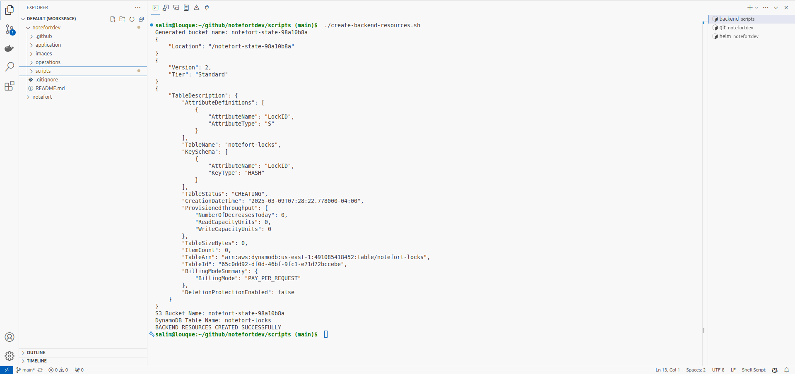
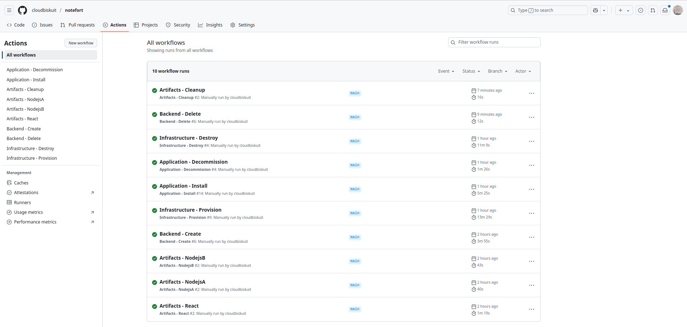
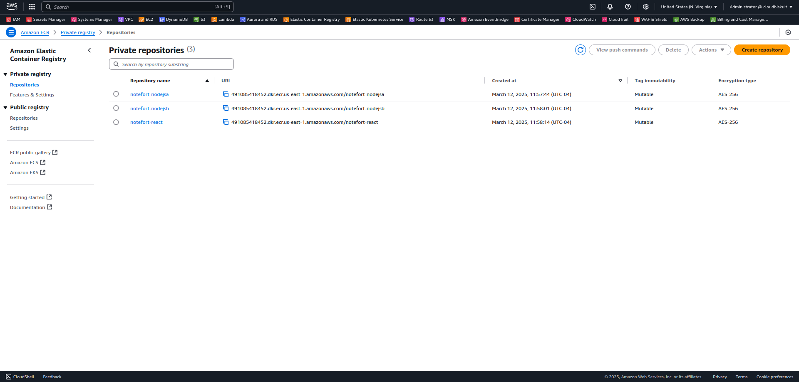

## About
No matter the size of your enterprise application, you could benefit from the design and deployment principles of NoteFort to ensure scalability and resilience in the cloud.

## Purpose
My primary goal is to demonstrate my expertise in cloud design and DevOps best practices.  

## Description
NoteFort ensures availability of your notes through a decoupled backend microservices architecture even if individual services experience downtime.  

## Design
The application uses a React-based user interface for input, which is processed by two Node.js backend services that communicate via RabbitMQ.

<br>

<div align="center">
  
</div>  

#### Key Concepts
- API requests are routed and proxied through Nginx proxy server.
- RabbitMQ handles the messaging queue for backend microservices.
- Backend services process input and store it in their corresponding databases.

## Architecture
Click on [this link](./images/architecture.jpeg) to to see the high-resolution version.

<p align="center">
  <a href="./images/architecture.jpeg">
    
  </a>
</p>

## Toolset
- **Docker**: Containers encapsulate application code and dependencies, ensuring consistency and portability across development, testing, and production environments.
- **Terraform**: Infrastructure as Code (IaC) streamlines cloud infrastructure management by automating resource provisioning and configuration through code. It ensures consistency, reduces human error, and simplifies version control, making infrastructure changes auditable and repeatable.  
IaC enables faster deployment, scaling, and recovery while supporting collaborative development practices. 
- **HashiCorp Cloud Vault**: HashiCorp Vault is a powerful tool for securely storing and accessing sensitive data such as API keys, database credentials, and other secrets. It provides centralized secret management, access control, and encryption, ensuring that applications can securely retrieve secrets without hardcoding them.
- **Kubernetes**: Kubernetes deployment offers scalable, automated, and resilient container orchestration for modern applications. It efficiently manages containerized workloads, automates resource allocation, and ensures high availability through self-healing mechanisms.  
With features like rolling updates, service discovery, and load balancing, Kubernetes simplifies application deployment and scaling. Additionally, its portability and integration with cloud-native environments make it ideal for managing complex, distributed applications across various cloud  environments.
- **Helm**: Helm is a package manager for Kubernetes that simplifies the deployment and management of applications by using Helm charts. It helps with versioning, rollbacks, and dependency management, making it easier to maintain and update applications in a Kubernetes cluster.
- **Cluster Autoscaler**: The Cluster Autoscaler scales the number of nodes in the Kubernetes cluster. If there are not enough resources on existing nodes to schedule new pods, the Cluster Autoscaler can add new nodes to the cluster.  
Conversely, if nodes are underutilized and pods can be moved to other nodes, the Cluster Autoscaler will remove idle nodes to save costs. 
- **VPA & HPA**: Vertical Pod Autoscaler (VPA) and Horizontal Pod Autoscaler (HPA) work together to optimize pod resource allocation and scaling:  
HPA adjusts the number of pod replicas based on CPU or memory utilization, ensuring optimal load distribution and availability.  
VPA, on the other hand, dynamically adjusts the resource requests and limits of individual pods based on usage, improving resource efficiency. 
- **Prometheus & Grafana**: Prometheus is an open-source monitoring and alerting toolkit designed for reliability and scalability. It collects and stores metrics in a time-series database, allowing for real-time monitoring of applications and infrastructure.  
Grafana is an open-source visualization and analytics platform that integrates with Prometheus to display the collected metrics in customizable, interactive dashboards. 

## Try it Out: Prerequisites

#### AWS OIDC Provider  
You have to Setup AWS OIDC Provider and create an IAM role to be used by GitHub Actions to authenticate with AWS, refer to the [AWS OIDC Provider guide](https://aws.amazon.com/blogs/security/use-iam-roles-to-connect-github-actions-to-actions-in-aws) for detailed instructions. You can grant the IAM role used by GitHub Actions the AdministratorAccess IAM Policy, in a production environment adhere to the principle of least privilege.

#### SSH Key Pair 
To generate and push to AWS the SSH pubic key required to SSH into EKS cluster public EC2 instances, from your system run `generate-ssh-keypair.sh` script:
   ```bash
   chmod +x generate-ssh-keypair.sh
   ./generate-ssh-keypair.sh
   ```

#### Remote Backend Resources
To create the S3 bucket and the DynamoDB Table, from your system run `create-backend-resources.sh` script:
   ```bash
   chmod +x create-backend-resources.sh
   ./create-backend-resources.sh
   ```
Ensure AWC CLI is configured on your system before running this script.

#### HashiCorp Cloud Vault Secrets
In HashiCorp Vault Cloud Secrets, Create a secret `MYSQL_PASSWORD`containing the MySQL database password. 

This secret is securely stored in HCP and later fetched during deployment using Kubernetes Secret to inject the database password into Kubernetes MySQL StatefulSets `mysqla` and `mysqlb` and Kubernetes Node.js Deployments `nodejsa` and `nodejsb`. 

#### Forking the Repositoy
Go to notefort repository page on GitHub and Click the "Fork" button at the top right of the page.

#### GitHub Actions Secrets 
Forking does not copy Github Actions Secrets. Create the following Github Actions Secrets in the newly forked repository:

- **AWS_ACCOUNT_ID**: The 12-digit AWS account number where the resources will be deployed.
- **AWS_REGION**: The AWS region (e.g., us-east-1) where the infrastructure will be provisioned.
- **GH_IAM_ROLE**: The name of the IAM role you created in the Prerequisites step.
- **AWS_USER**: The IAM user to be given administrative priviliges on the EKS cluster, this user will be able to view and manage the new EKS cluster in the AWS Console and from AWS CLI. 
- **HCP_CLIENT_ID**: The HCP service principal client ID.
- **HCP_CLIENT_SECRET**: The HCP service principal client secret.
- **HCP_API_ENDPOINT**: The HCP API Endpoint URL for HashiCorp Cloud Platform (HCP) Vault Secrets.

Additionally, create the following Github Actions Variable:
- **EKS_CLUSTER_NAME**: "notefort-cluster"

## Try it Out: Go Live
#### Artifacts - React
This workflow performs the following tasks:
- Create AWS ECR notefort-react registry if it does not already exist.
- Build, tag (commit hash + latest), and push the image to AWS ECR Registry.
- Replace the image tag in the react.yaml Kubernetes deployment file with the latest commit hash, and commit the updated file to the GitHub repository.

#### Artifacts - NodejsA
This workflow performs the following tasks:
- Create AWS ECR notefort-nodejsa registry if it does not already exist.
- Build, tag (commit hash + latest), and push the image to AWS ECR Registry.
- Replace the image tag of nodejsa in the values.yaml Kubernetes Helm file with the latest commit hash, and commit the updated file to the GitHub repository.

#### Artifacts - NodejsB
This workflow performs the following tasks:
- Create AWS ECR notefort-nodejsb registry if it does not already exist.
- Build, tag (commit hash + latest), and push the image to AWS ECR Registry.
- Replace the image tag of nodejsb in the values.yaml Kubernetes Helm file with the latest commit hash, and commit the updated file to the GitHub repository.

#### Artifacts - Cleanup
This workflow deletes the AWS ECR registries belonging to the application.

#### Infrastructure - Provision
This workflow performs the following jobs:

- Intialize Terraform state in the newly created bucket.
- Provision the AWS infrastructure and the EKS cluster resources.
- Map the IAM user to Kubernetes RBAC.
- Install the Cluster Autoscaler, the Vertical Pod Autoscaler (VPA), and the Metrics Server in the EKS `kube-system` namespace.
- Install Prometheus and its Adapter, and Grafana in the EKS `monitoring` namespace.

Note: The code is ready for multiple environments (e.g., development and production), modify `dev.tfvars` and `prod.tfvars` as needed (e.g., launch template instance type, node group desired min max). Additionaly, modify `terraform apply` commands to account for `.tfvars` files.

Note: the IAM user defined in the GitHub Actions Variable `AWS_USER` will be mapped to the system:masters EKS RBAC group, granting them administrative privileges on the newly created cluster. As a result, `AWS_USER` will be able to view and manage the new EKS cluster in the AWS Console and from AWS CLI. 

Note: The necessary IAM permissions for the Cluster Autoscaler to modify EKS node groups have already been accounted for by attaching a managed IAM policy to the IAM role associated with the node groups.

Note: Follow the instructions provided in the workflow output to get Grafana password, and to port-forward a tunnel to Grafana. To access Grafana UI on your system, go to: https://localhost:3000

Note: On your system, run the following command to port-forward to Prometheus: kubectl port-forward -n monitoring svc/prometheus-operated `port`:9090 where port is a free port on your local system. To access Prometheus UI on your system, go to: https://localhost:`port`

#### Infrastructure - Destroy
This workflow destroys the AWS infrastructure and the EKS cluster.

Additionaly, To delete the S3 bucket and the DynamoDB Table, from your system run `delete-backend-resources.sh` script:
   ```bash
   chmod +x delete-backend-resources.sh
   ./delete-backend-resources.sh
   ```

Ensure AWC CLI is configured on your system before running this script.

#### Application - Install
This workflow Installs the application Helm chart. The `URL` will be provided in the terminal output after the Workflow completes.

Note: The Helm chart is ready for multiple instances of the application (e.g., development and production).

#### Application - Decommission
This workflow performs the following Steps:
- Delete HPA to prevent it from scaling up Pods.
- Scale down stateless services.
- Gracefully stop RabbitMQ service.
- Prepare MySql statefulsets for for graceful shutdown and scale them down.
- Uninstall the application Helm chart.

## PoC
Here's a demonstration of Notefort successfully deployed on AWS EKS and running as expected, confirming the end-to-end setup from infrastructure provisioning to application deployment.

<br>

<div align="center">
  
</div>  

<div align="center">
  
</div>  

<div align="center">
  
</div>  

<div align="center">
  
</div>  

<div align="center">
  
</div>  

<div align="center">
  
</div>  

<div align="center">
  
</div>  

<div align="center">
  
</div>  

<div align="center">
  
</div>  

<div align="center">
  
</div>  

<div align="center">
  
</div>  

<div align="center">
  
</div>  

<div align="center">
  
</div>  

<div align="center">
  
</div>  

<div align="center">
  
</div>  

<div align="center">
  
</div>  

<div align="center">
  
</div>  

<div align="center">
  
</div>  

<div align="center">
  
</div>  

<div align="center">
  
</div>  

<div align="center">
  
</div>  

<div align="center">
  
</div>  

<div align="center">
  
</div>  

<div align="center">
  
</div>  

<div align="center">
  
</div>  

<div align="center">
  
</div>  

## Future Improvements
- ArgoCD & ArgoRollouts

## Contact
[salim.zaza@outlook.com](mailto:salim.zaza@outlook.com)