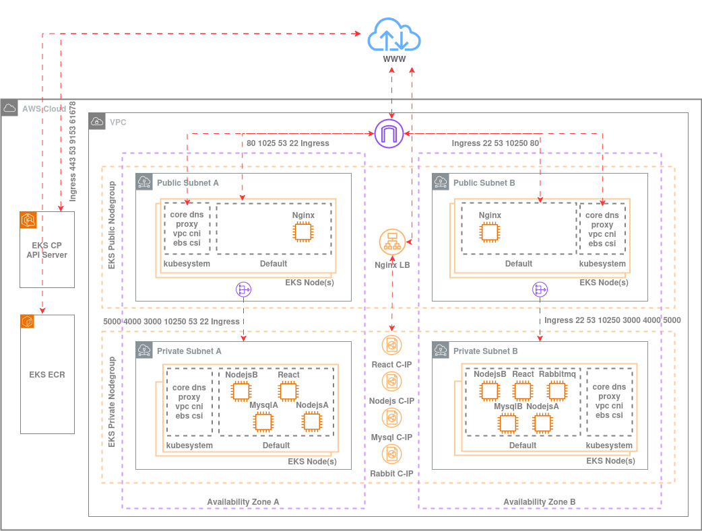

## About
No matter the size of your enterprise application, you could benefit from the design and deployment principles of NoteFort to ensure scalability and resilience in the cloud.

## Purpose
I have created a simple microservices application, NoteFort, to serve as a demo-app for showcasing my expertise in Cloud, DevOps, and GitOps best practices. 

## Application Design
The application has a React frontend and two Express.js backend services that communicate via RabbitMQ.

<br>

<div align="center">
  
</div>  

#### Key Concepts
- NodeJS Backend services process input and store your notes in their corresponding databases.
- NodeJS Backend services produce and consume messages using RabbitMQ.
- Nginx Proxy Server routes and proxies API requests.
- RabbitMQ handles the messaging queue for backend microservices.

## Cloud Architecture
Click on [this link](./images/architecture.jpeg) to to see the high-resolution version.

<p align="center">
  <a href="./images/architecture.jpeg">
    
  </a>
</p>

## Toolset
- AWS EKS, Autoscaler, VPA & HPA
- Helm Chart
- ArgoCD
- HashiCorp Cloud Vault
- Serverless Framework
- AWS Lambda
- AWS API Gateway & Authorizer's
- AWS CloudFormation
- JWT
- Auth0 API's
- Auth0 Application's
- Prometheus
- Grafana
- Github Actions
- Docker
- Terraform

## Try it Out: Prerequisites

#### AWS GITHUB OIDC Provider  
You have to Setup AWS OIDC Provider and create an IAM role to be used by GitHub Actions to authenticate with AWS, refer to the [AWS OIDC Provider guide](https://aws.amazon.com/blogs/security/use-iam-roles-to-connect-github-actions-to-actions-in-aws) for detailed instructions.  

You can grant the IAM role used by GitHub Actions the AdministratorAccess IAM Policy, in a production environment adhere to the principle of least privilege.

#### HashiCorp CLOUD VAULT SECRETS
In HashiCorp Vault Cloud Secrets, Create a secret MYSQL_PASSWORDcontaining the MySQL database password. 

This secret is securely stored in HCP and later fetched during deployment using Kubernetes Secret to inject the database password into Kubernetes MySQL StatefulSets mysqla and mysqlb and Kubernetes Node.js Deployments nodejsa and nodejsb. 

#### Auth0 MANAGEMENT CLIENT
My workflows will create Auth0 clients and servers for AWS API Gateway authorizers. These workflows require access to the Auth0 Management API.  

For this to work, in the Auth0 Dashboard you need to (1) create an Auth0 Management Application  and (2) Authorize the Auth0 Management API. Take note of your Client ID, Client Secret, and Auth0 Domain.

#### GITHUB PERSONAL ACCESS TOKEN (PAT)
My workflows will create GitHub Actions Secrets, this requires a GitHub PAT. You have to create a GitHub fine-grained PAT (GH_PAT_SECRETS) with read-write permissions to the repository Secrets.

#### GITHUB ACTIONS SECRETS
Create the following Github Actions Secrets:

- **GH_ACCOUNT**: The name of your GitHub account.
- **GH_IAM_ROLE**: The name of the IAM role you created in the Prerequisites step.
- **GH_PAT_SECRETS**: The PAT that you created in the Prerequisites step.
- **AWS_ACCOUNT_ID**: The 12-digit AWS account number where the resources will be deployed.
- **AWS_REGION**: The AWS region (e.g., us-east-1) where the infrastructure will be provisioned.
- **AWS_USER**: The IAM user to be given administrative priviliges on the EKS cluster, this user will be able to view and manage the new EKS cluster in the AWS Console and from AWS CLI. 
- **AWS_EKS_CLUSTER_NAME**: "notefort-cluster".
- **HCP_CLIENT_ID**: The HCP service principal client ID.
- **HCP_CLIENT_SECRET**: The HCP service principal client secret.
- **HCP_API_ENDPOINT**: The HCP API Endpoint URL for HashiCorp Cloud Platform (HCP) Vault Secrets.
- **AUTH0_DOMAIN**: The tenant of your Auth0 account (format: https://your-domain.ca.auth0.com/).
- **AUTH0_MANAGEMENT_CLIENT_ID**: The Client ID of your Auth0 Management Client that you created in the Prerequisites step.
- **AUTH0_MANAGEMENT_CLIENT_SECRET**: The Client Secret of your Auth0 Management Client that you created in the Prerequisites step. 

#### EKS NODES SSH KEY PAIR
To generate and push to AWS the SSH pubic key required to SSH into EKS cluster public EC2 instances, from your system run generate-ssh-keypair.sh script:
   ```bash
   chmod +x generate-ssh-keypair.sh
   ./generate-ssh-keypair.sh
   ```
Ensure you have setup AWS CLI before running this script.

## Try it Out: Go Live
On first setup, execute these workflows in order. The workflows are fully automated and will also run on any changes to the base code in the repository.

#### Artifacts - React
This workflow performs the following tasks:
- Create AWS ECR notefort-react registry if it does not already exist.
- Build, tag (commit hash + latest), and push the image to AWS ECR Registry.
- Replace the image tag in the react.yaml Kubernetes deployment file with the latest commit hash, and commit the updated file to the GitHub repository.

#### Artifacts - NodejsA
This workflow performs the following tasks:
- Create AWS ECR notefort-nodejsa registry if it does not already exist.
- Build, tag (commit hash + latest), and push the image to AWS ECR Registry.
- Replace the image tag of nodejsa in the values.yaml Kubernetes Helm file with the latest commit hash, and commit the updated file to the GitHub repository.

#### Artifacts - NodejsB
This workflow performs the following tasks:
- Create AWS ECR notefort-nodejsb registry if it does not already exist.
- Build, tag (commit hash + latest), and push the image to AWS ECR Registry.
- Replace the image tag of nodejsb in the values.yaml Kubernetes Helm file with the latest commit hash, and commit the updated file to the GitHub repository.

#### Backend - Create
This workflow deploys Lambda functions (create_backend_resources & delete_backend_resources), sets up an HTTP API Gateway and integrates it with Auth0 for secure API access.  

The workflow performs the following tasks:
- The backend service is deployed using the Serverless Framework. At this stage, a dummy Auth0 API identifier/audience is used.
- An Auth0 API is created (NOTEFORT-API) with the URL of the deployed API Gateway. This is done programmatically using Auth0’s Management API.
- An M2M Auth0 application (NOTEFORT-APP) is created to interact with the newly deployed API, it is then granted permissions to access the newly created Auth0 API.
- The Serverless Framework is used to redeploy the backend service, but this time with the actual Auth0 API identifier/audience.
- Set API Gateway URL, Auth0 Management Client ID and Secret as GitHub Secrets.

The Lambda function create_backend_resources is invoked at the end of the workflow to provision an S3 and a DynamoDB Table required by Terraform.

#### Infrastructure - Provision
This workflow performs the following jobs:

- Intialize Terraform state in the newly created bucket.
- Provision the AWS infrastructure and the EKS cluster resources.
- Map the IAM user to Kubernetes RBAC.
- Install the Cluster Autoscaler, the Vertical Pod Autoscaler (VPA), and the Metrics Server in the EKS `kube-system` namespace via Helm.
- Install Prometheus and its Adapter, and Grafana in the EKS `monitoring` namespace via Helm.
- Install ArgoCD via Helm.

The Terraform directory structure is ready for multiple environments (e.g., development and production), modify `dev.tfvars` and `prod.tfvars` as needed (e.g., launch template instance type, node group desired min max). Additionaly, modify `terraform apply` commands to account for `.tfvars` files.

The IAM user defined in the GitHub Actions Variable `AWS_USER` will be mapped to the system:masters EKS RBAC group, granting them administrative privileges on the newly created cluster. As a result, `AWS_USER` will be able to view and manage the new EKS cluster in the AWS Console and from AWS CLI. 

The necessary IAM permissions for the Cluster Autoscaler to modify EKS node groups have already been accounted for by attaching a managed IAM policy to the IAM role associated with the node groups.

#### Application - Install
This workflow Creates an ArgoCD Application using NoteFort Helm chart. After the Workflow completes, the `URL` will be provided in the terminal output.

Note: The Helm chart is ready for multiple instances of the application (e.g., development and production).

#### How to Access Prometheus, Grafana and ArgoCD
Prometheus: Follow the instructions provided in the workflow output to get the username/password, and to port-forward a tunnel to Prometheus. To access Prometheus UI on your system, go to: https://localhost:`port`

Grafana: Follow the instructions provided in the workflow output to get the username/password, and to port-forward a tunnel to Grafana. To access Grafana UI on your system, go to: https://localhost:`port`

ArgoCD: Follow the instructions provided in the workflow output to get the username/password, and to port-forward a tunnel to ArgoCD. To access ArgoCD UI on your system, go to: https://localhost:`port`

Note: Ensure to update your kubeconfig by running: eksctl utils write-kubeconfig --region your-region --cluster notefort-cluster

#### Application - Decommission
This workflow performs the following Steps:
- Delete HPA to prevent it from scaling up Pods.
- Scale down stateless services.
- Gracefully stop RabbitMQ service.
- Prepare MySql statefulsets for for graceful shutdown and scale them down.
- Delete ArgoCD NoteFort Application.

#### Infrastructure - Destroy
This workflow destroys the AWS infrastructure and the EKS cluster.

Additionaly, To delete the S3 bucket and the DynamoDB Table, from your system run `delete-backend-resources.sh` script:
   ```bash
   chmod +x delete-backend-resources.sh
   ./delete-backend-resources.sh
   ```

Ensure AWC CLI is configured on your system before running this script.

#### Backend - Delete
This workflow invokes the Lambda Function delete_backend_resources to delete the S3 and the DynamoDB Table.

#### Artifacts - Cleanup
This workflow deletes the AWS ECR registries belonging to the application.

## PoC
Here's a demonstration of Notefort successfully deployed on AWS EKS and running as expected, confirming the end-to-end setup from infrastructure provisioning to application deployment.

<br>

<div align="center">
  
</div>  

<div align="center">
  
</div>  

<div align="center">
  
</div>  

<div align="center">
  
</div>  

<div align="center">
  
</div>  

<div align="center">
  
</div>  

<div align="center">
  
</div>  

<div align="center">
  
</div>  

<div align="center">
  
</div>  

<div align="center">
  
</div>  

<div align="center">
  
</div>  

<div align="center">
  
</div>  

<div align="center">
  
</div>  

<div align="center">
  
</div>  

<div align="center">
  
</div>  

<div align="center">
  
</div>  

<div align="center">
  
</div>  

<div align="center">
  
</div>  

<div align="center">
  
</div>  

<div align="center">
  
</div>  

<div align="center">
  
</div>  

<div align="center">
  
</div>  

<div align="center">
  
</div>  

<div align="center">
  
</div>  

<div align="center">
  
</div>  

<div align="center">
  
</div>  

<div align="center">
  
</div>  

<div align="center">
  
</div>  

<div align="center">
  
</div>  

<div align="center">
  
</div>  

<br>

## Contact
[salim.zaza@outlook.com](mailto:salim.zaza@outlook.com)